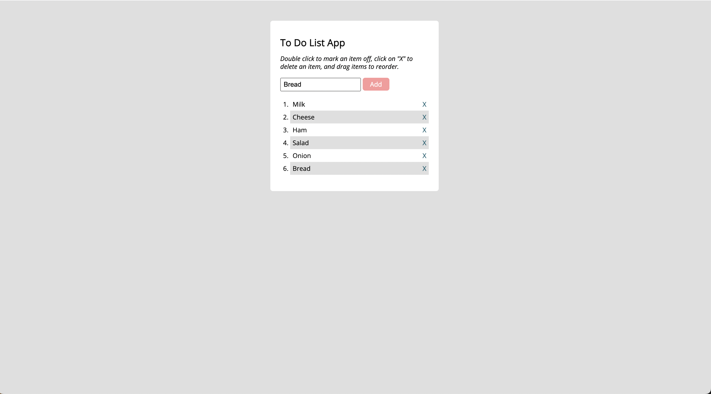

# To-do-list App
Task 1.9 Introduction to jQuery. A simple app to add and remove items from a (e.g., shoopping list) written in j.Query.

#### To run the app, click this link: 

 

<strong>[LIVE DEMO](https://koola123.github.io/to-do-list-app/)</strong>

 

 

Version 1.0.0

